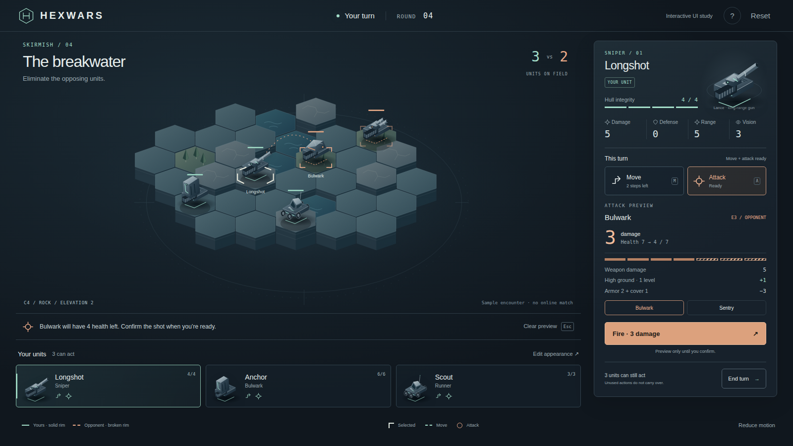
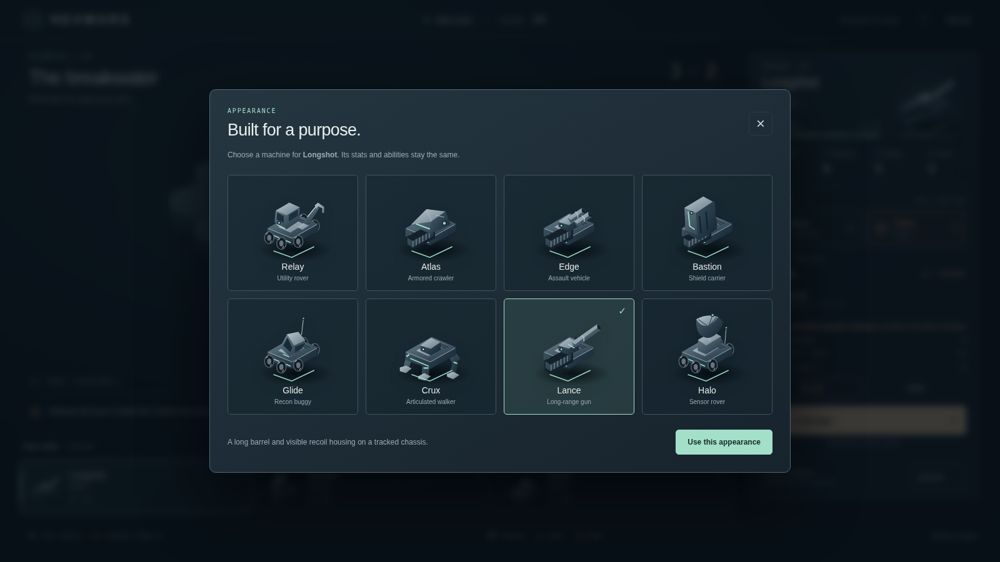
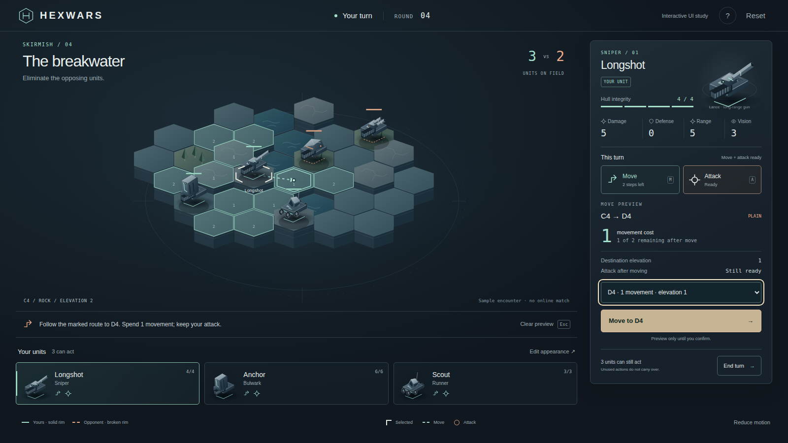

# Gameplay cues and a more tangible army

**Review update: 2026-09-25.** Gameplay cues and UI take priority. Keep the dark palette and
H-in-hex mark. Replace the abstract sculptures with simple machines whose parts suggest a
purpose. This supersedes the earlier emphasis on abstract unit silhouettes in
[unit-art-direction.md](unit-art-direction.md).

Open the **[interactive tactical study](concept/tactical.html)** or double-click
[Open Tactical Study.cmd](<concept/Open Tactical Study.cmd>) on Windows. It works directly from
disk without packages, a server or external assets. The local served preview is
`http://localhost:8198/tactical.html` while the preview process is running.

This is a new HTML/CSS/SVG study on `codex/gameplay-visual-language-20260925`, based on merged
PR #23 (`474f0a7`). It has not replaced the Unity interface, units or WebGL bundle.

## What changed in the direction

| Addition | What to review |
|---|---|
| The board becomes the main surface | The designer and barracks no longer compete with the active move. Three selectable squad entries sit beneath the board; the right panel follows the selected unit. |
| Selection has its own shape | White corner brackets identify the selected unit. Ownership remains a separate solid mint or broken copper chassis rim. |
| Movement has a consistent treatment | Mint outlines mark reachable cells; numbers show cost, a dotted route previews the path, and the confirm button uses the same color. |
| Attacks explain the consequence | Copper target brackets, a shot line, a health-loss pattern and one damage forecast lead to an explicit Fire button. The preview lists weapon damage, height and defense. |
| Availability stays visible | Move and Attack each show Ready, remaining movement or Used. The squad retains the same action symbols when another unit is selected. |
| Terrain provides evidence | Stepped sides show height, rock faces have seams, forest has small tree forms and water has surface lines. The selected cell's material and elevation are written beneath the board. |
| Machines have recognizable components | Tracks, wheels, armor plates, barrels, a tool arm, articulated legs and a radar dish replace the abstract art language. |
| Appearance remains a deliberate choice | Open Edit appearance, choose any of the eight named forms, and apply it. The board, portrait and squad change together; stats, role and forecast do not. |
| The composition is more restrained | Neutral dark panels, brighter machined edges, generous board space and a limited action palette. Compact desktop layouts keep the confirmation and End turn controls in view. |

The names Relay, Atlas, Edge, Bastion, Glide, Crux, Lance and Halo remain artwork names. They do
not introduce fixed classes or new abilities. The mechanical role is displayed separately.

## Try the decision sequence

1. Start on Longshot. The initial Bulwark preview is **3 damage**, leaving **4 of 7 health**:
   weapon 5, height +1, armor 2 and cover 1. Nothing happens until Fire is selected.
2. Select **Move** or press **M**. Choose D4 on the board or in the destination selector.
   Its route costs one movement. Confirm: Longshot moves down one level, retains its attack,
   and the shot against Bulwark becomes **2 damage**.
3. Select another unit and return to Longshot. Its spent movement stays spent. Fire, then
   verify Attack reads Used and cannot be repeated. Movement is still available if unspent.
4. Reset, preview Sentry and see a lethal outcome before firing. The target and enemy count
   update only after confirmation.
5. Open **Edit appearance**. Try Halo or the new Relay tool rover. Close without applying to
   discard the draft, or apply to compare the same unit on the board. No stats change.
6. End turn shows remaining availability and allows cancellation. The study explicitly says
   it advances the local preview without simulating an opponent. Reset restores the fixture.

The guide button explains the cues. Keyboard alternatives include squad buttons, **M**, **A**,
**Escape**, Enter/Space on board units and reachable cells, and a movement destination selector.
Dialogs support Escape and native focus handling. Reduced motion respects the OS preference
and has a visible toggle. Ownership, selection, readiness and health loss use shapes or text
alongside color.

## Integration boundary

The fixture is intentionally small and local. It uses five units, a fixed visible board, a
shortest-path movement example and no opponent simulation, fog, multiplayer, deployment,
saved designs, economy or replay. Appearance edits last only until Reset or reload and cannot
change the player's actual barracks. Reloading is not a saved-game workflow.

The damage example follows the shape of
[CombatResolver.ComputeDamage](../../engine/HexWars.Engine/CombatResolver.cs): zero attack damage
remains zero; otherwise damage is weapon plus positive elevation advantage minus defense,
with a zero floor. The study chooses a cover bonus of one for its forest cells. Movement uses
a local illustrative cost and range check; these are not engine legality or line-of-sight proofs.
The screenshot values describe this fixture, not a new game balance proposal.

For a Unity implementation, use existing engine results for the displayed move paths, legal
targets, damage, visibility and action availability. Keep a preview separate from command
submission; wait for authoritative acceptance before displaying a committed result online.
Do not transplant the study's simulation code into the game.

Port the presentation in this order:

1. Selected-unit panel and squad availability, with the designer in a deliberate secondary view.
2. Shared shape/color rules for selection, movement, targeting and spent actions; expose exact
   engine forecasts with brief explanations.
3. Build the approved machine forms as meshes, preserving existing appearance IDs and their
   command/catalog/replay path. Keep collision and gameplay independent of appearance.
4. Validate in the actual Unity player at common zooms and elevations, with fog, both owners,
   custom unit designs, keyboard input and smaller windows. Rebuild WebGL after that integration.

No production gameplay behavior or Unity source changed in this study. Its browser validation
does not establish Unity performance, fog correctness or multiplayer behavior.

## Checks

The [browser receipt](evidence/tactical-ui-checks.json) records 14 successful interaction groups:
preview versus commit, movement/forecast changes, spent-action retention, lethal attacks,
turn cancellation, all eight cosmetic choices, keyboard access, reduced motion, mobile dialog
scrolling and direct-file startup. Layouts were checked at 1600×900, 1280×720, 1920×1080 and
390×844 with no horizontal overflow. No page errors or failed requests occurred.

Review the [1280px view](evidence/tactical-ui-1280.png), [mobile layout](evidence/tactical-ui-390.png)
and [1920px view](evidence/tactical-ui-1920.png). Mobile deliberately stacks the decision panel
below the board; it is a reviewable responsive study, not a claim of a finished touch game.
Source uses no downloaded fonts or artwork. JavaScript syntax and formatting checks also pass.

These checks establish interaction consistency. Attractiveness and rapid recognition still
need your judgment and, later, observation with players unfamiliar with the game.
