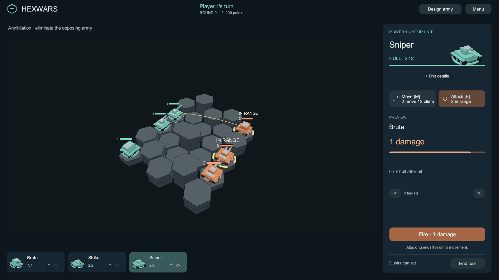
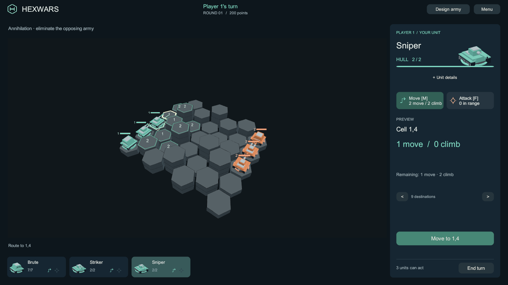
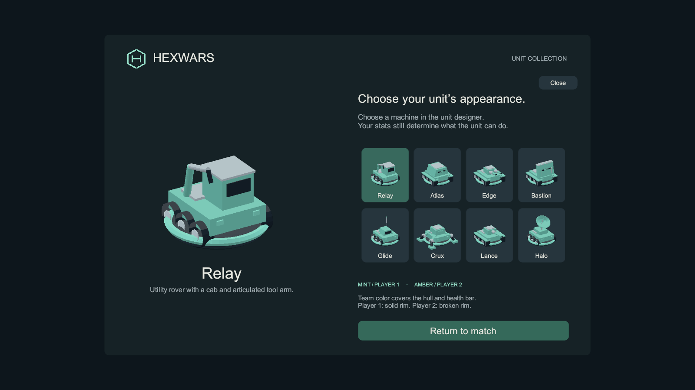
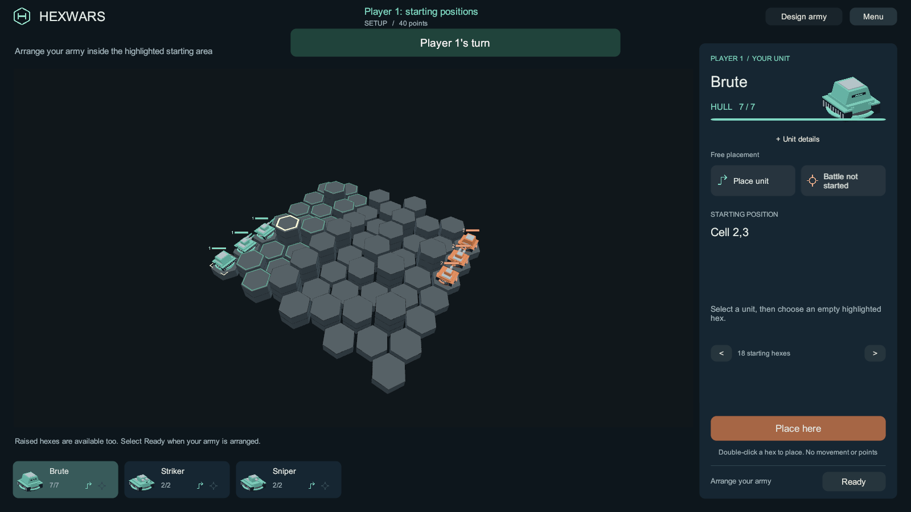
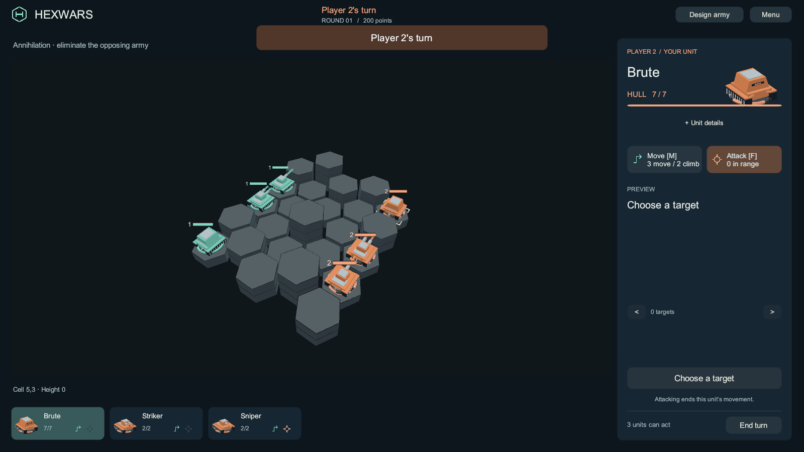

# Tactical interface and recognizable machines

**Implementation update — 2026-09-25.** The approved direction is now implemented in the Unity
player. The browser [design study](concept/tactical.html) remains available as the original review
artifact; its small illustrative simulation is independent of the game.

**Cleanup update.** The default panel now shows the decision and its consequence. Unit stats and
combat arithmetic open under **Unit details**. Squad cards are smaller, repeated labels are removed,
and help/tips live inside Menu. The board gains vertical space.

**Battlefield clarity update.** Broad mint/copper hulls, owner-colored health bars and player numbers
make ownership visible at normal board scale. Player 2's inspector, squad, barracks and designer
portraits use the same team treatment. Solid/broken rims remain distinct when color is hard to read.
Starting armies now fill their own back edges in mirrored role order. Biome colors, details and
cell labels are hidden when biome rules are disabled. Selecting a unit marks attackable opponents
with wider pale-gold brackets and **IN RANGE**; a movement preview uses **AFTER MOVE**.

**Placement and input update.** Enable **Place starting units** in match setup to arrange each army
freely on unoccupied home-zone hexes, including raised ground. Select a unit and double-click a
highlighted hex, or preview and choose **Place here**. Each player presses **Ready**; battle then
starts at round one with all points and movement intact. The AI keeps its automatic formation.
Leaving the option off starts immediately with mirrored backlines.

Escape closes the topmost help, confirmation or designer immediately, including while editing a
designer field. Automatic coaching is smaller, expires after six seconds, and never replaces an
explicitly opened reference. A kill reports its bounty without a designer prompt.

The PR review fixes keep the human squad visible during the opponent's turn, keep submitted
commands locked through reconnect status events, and place territory actions inside the HUD footer.

## Review map

| Addition | In the game |
|---|---|
| A focused battlefield | A selected-unit panel and scrollable squad replace the competing always-open army tools. **Design army** opens the existing designer and barracks. |
| Deliberate actions | Click a destination or opponent to preview; double-click that same destination or target to commit, or use the confirmation button. Slow repeated clicks and clicks on different targets only preview. Escape cancels. |
| Starting formation | Optional free placement inside each player's starting area, followed by Ready for each army. Automatic placement remains the default. |
| Movement evidence | Mint cell outlines, horizontal costs, a route line, and separate movement/climb costs and remaining budgets come from `MovementService.Routes`. |
| Attack evidence | Pale-gold target brackets and range markers, a shot line, health remaining/lost, and the exact weapon/height/armor/terrain breakdown come from engine-validated attacks. |
| Availability | The squad retains per-unit move and attack symbols. Spent attacks remain visible. End turn asks for confirmation and shows how many units can still act. |
| Tangible pieces | Relay's tool rover, Atlas's armored crawler, Edge's twin-gun carrier, Bastion's shield tank, Glide's buggy, Crux's walker, Lance's long gun and Halo's radar rover replace the abstract forms. |
| Terrain detail | Forest forms, water lines, rock seams and biome colors appear only when biome rules are enabled. Elevation remains visible in both modes. |
| Quieter presentation | Dark panels, the H-in-hex mark, explicit labels, and a persisted **Menu → Reduced motion** option. This removes camera shake/glides, projectiles, unit travel/drop animations and explosion flashes while retaining state changes and sounds. |

## Try it

Open the [Windows player](../../Build/TacticalPreview/HexWars.exe), or serve the committed WebGL
files using the [browser instructions](webgl-preview.md). Start a local match.

1. Select a unit on the board or in the squad. Choose **Move [M]**, then a destination. Check both
   movement and climb budgets before confirming. Double-click the destination to move directly.
2. See **IN RANGE** markers immediately on selecting your unit. Choose **Attack [F]** and an opponent. The panel shows damage and health after the shot. Confirm
   to fire, or double-click the target. **Attacking ends movement for that unit**, matching the existing engine rule.
3. Switch units and return: used actions stay used. Select End turn, then Keep playing to cancel.
4. Open **Design army**. Choose one of the eight appearances, change stats/name, save the template,
   and deploy it from the barracks. Appearance stays cosmetic and uses the existing catalog,
   deployment, command and replay IDs. Existing designs retain their selected form.
5. Open Menu for sound and Reduced motion. Use WASD/arrows to pan, Q/E to orbit, and the wheel to
   zoom. The preview arrows offer an alternative to choosing a destination/target on the board.
6. Press Escape to dismiss help or leave the designer immediately. With no panel open, Escape
   cancels a preview; another press opens Menu.

The collection describes forms, not fixed classes or new abilities. The selected unit's actual
role and stats remain separate. Player 1 uses a solid mint rim and Player 2 a broken copper rim.
Small screens stack the decision panel below the board; the panel scrolls while confirmation and
End turn remain visible. This pass targets desktop. The 390px layout is a smoke check, and still needs
larger touch text/controls and a separate pass on the secondary army tools.

## Rule and online boundaries

Previews never mutate the match. An authoritative state change invalidates a locked preview.
Commands online show a pending state until the existing server echo/rejection arrives; sending a
command is not presented as a confirmed hit. Hidden opponents are excluded from inspection,
target lists and damage forecasts. Zero-damage units and configured terrain bonuses use the
engine's actual formula. The default match has terrain bonuses disabled, which Unit details
states explicitly. Movement and climb are separate budgets, and attacking closes movement.

The initial formation now mirrors Player 2 from its own back edge, including role order. Optional
starting placement is a separate phase: combat, deployment and turn actions cannot run until both
armies are ready. Terrain generation and battle combat/movement rules are unchanged.

Manual placement adds an optional setup/replay flag and `P` / `READY` commands. Updated readers
accept older records; automatic setup retains its previous wire form. Both clients and the server
must use this revision for manual placement. Custom Steam lobbies accept the option; quick-v1
retains automatic placement. Browser multiplayer uses the existing Legacy WebSocket server;
native Steam lobbies remain a separate launch path. This work does not deploy or merge the branch.

## Validation

The implementation receipt and build hashes are recorded in
[evidence/tactical-implementation-checks.json](evidence/tactical-implementation-checks.json).
Native screenshots come from ordinary seeded matches using the actual Unity renderer and legal
engine commands. The opt-in `-tactical-capture <folder>` path is Windows-only; it does not add a
browser debug route or alter an ordinary launch.

The first PlayMode run caught a missing CanvasRenderer on the action symbols. The first native
render caught uncleared pixels outside a partial camera viewport and framing polluted by transient
board cues. Those failures were retained in `Library/TacticalImplementation` and fixed before the
final captures/build. The older HTML study's 14 browser interaction groups are separate evidence.

The initial implementation passed **671 EditMode + 13 PlayMode** checks. The latest battlefield
clarity and placement revision passes **671 EditMode, 27 PlayMode, 118 focused engine and 77 lobby-validation** checks. Build hashes, browser evidence and the incomplete full research/Gym suite are recorded separately in [battlefield-clarity-checks.json](evidence/battlefield-clarity-checks.json). The browser-discovered stale demo
selection reference is fixed by resolving views through the current TokenStore, with a regression
that rebuilds a match and selects before the old objects are destroyed.

A later WebGL build hit a UnityLinker `AccessViolationException` while reading assembly metadata.
The failed log is retained as `Library/TacticalImplementation/webgl-linker-crash.log`; the build
was retried without weakening validation. Browser labels use ordinary text where its runtime font
omitted a punctuation glyph.
