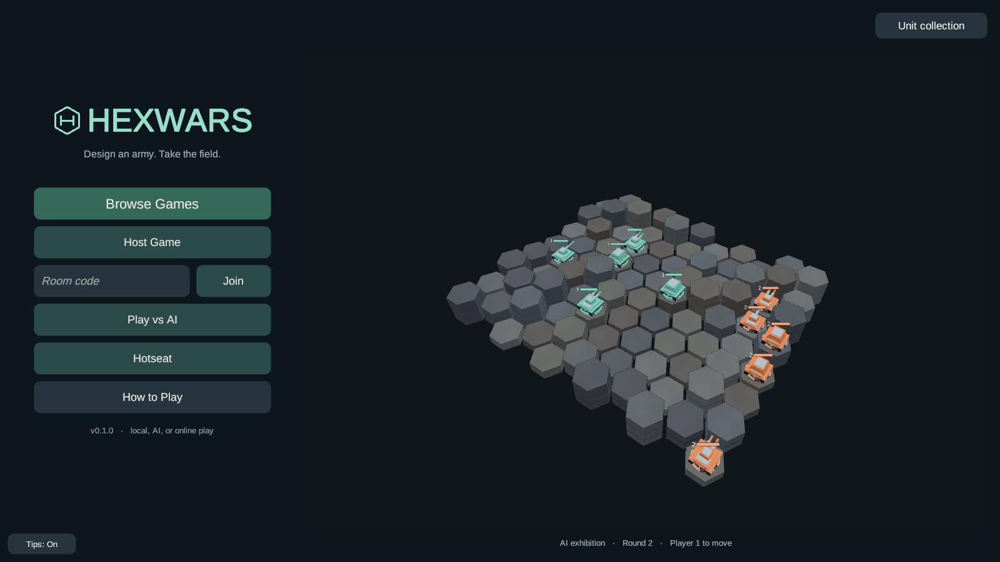

# Board and title polish

The title menu sits beside the live AI match on wider screens, and below it in portrait.
The camera frames the board inside that clear space. A quiet round/turn caption shows the
exhibition progressing. The H mark sits directly beside HEXWARS; the match header also
uses tighter spacing.

The menu adapts without replacing room-code input or covering the demo. Opening setup
restores the full background camera; a real match takes over with the tactical viewport.
See the [smaller-window capture](previews/title-small-web.png) and
[portrait capture](previews/title-portrait-web.png).

Neutral hexes use eight restrained slate, charcoal and warm-grey finishes, with faint
surface variation. The palette is cosmetic: it is chosen from coordinates independently of
biomes, elevation and game state, and stays stable across turns and board rebuilds.
Ownership tint and tactical overlays remain distinct. Biome-enabled modes retain their
terrain colors and symbols; biome and generator mechanics remain available for other modes.

The hotseat capture uses seed 7, a 9x7 board and three actions per turn. Source and the rebuilt
WebGL payload are on `codex/hex-surface-variation-20260927`, staged in the actual served path,
`engine/HexWars.NetServer/wwwroot`. Main and web-main are unchanged by this feature branch.

The final browser cache key is `85e81920`. Coplay reported no compile or Unity errors.
All 713 EditMode and 49 PlayMode tests passed, covering stable neutral finishes, preserved
biome presentation, room-code entry through resizing, demo camera ownership and transitions.
Unity 6000.5.0f1 built WebGL with zero errors in 5m13s. Chrome loaded the new payload,
showed the AI advance from round 1 to round 2, rendered the title at 1600x900, 1024x768 and
390x844, survived eight additional rapid orientation switches, and entered a seed-7 hotseat
match with no console/page errors or failed requests. The first browser pass exposed a
transient zero-height viewport during resizing; the final build waits for canvas scaling,
retains the last usable viewport and limits board raycasts to the visible camera area.
Build logs, test XML, browser receipts and payload hashes are retained in `Library/TitleView`;
the original surface work is recorded in `Library/HexSurface`.

Local visual preview: serve `engine/HexWars.NetServer/wwwroot` over HTTP and choose Hotseat
or Play vs AI. A static preview does not provide the multiplayer server endpoints.
