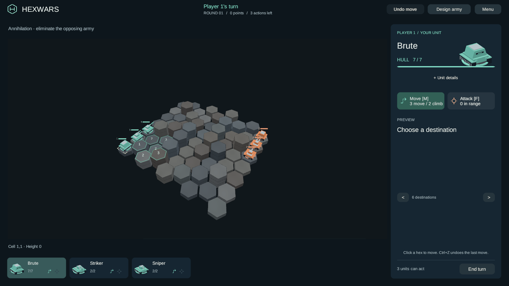

# Varied hex surfaces

Neutral hexes now use eight restrained slate, charcoal and warm-grey finishes, with a faint
surface variation. The palette is cosmetic: it is chosen from coordinates independently of
biomes, elevation and game state. It stays stable across turns, moves and board rebuilds.
Team ownership tint and tactical overlays remain distinct.

Biome-enabled modes retain their terrain colors and symbols. Biome and generator mechanics
are unchanged and remain available for other game modes.

This capture is the actual WebGL game at seed 7, 9x7, three actions per turn. The rebuilt
browser payload is staged in `engine/HexWars.NetServer/wwwroot`, with cache key `dcec2ca8`.
The source and build are on `codex/hex-surface-variation-20260927`; main and web-main are
unchanged by this feature branch.

Validation: Coplay reported no compile errors or Unity errors; all 48 PlayMode tests passed,
including biome toggling, stable neutral finishes, ownership and interaction checks.
Unity 6000.5.0f1 built WebGL successfully with zero errors in 8m39s. Chrome loaded the
new cache key, entered a local hotseat game and reported no page errors or failed requests.
The final screenshot confirms movement highlights, team colors and the H logo remain visible.
Build logs, browser receipts and payload hashes are retained in `Library/HexSurface`.

Local visual preview: serve `engine/HexWars.NetServer/wwwroot` over HTTP and choose Hotseat
or Play vs AI. A static preview does not provide the multiplayer server endpoints.
