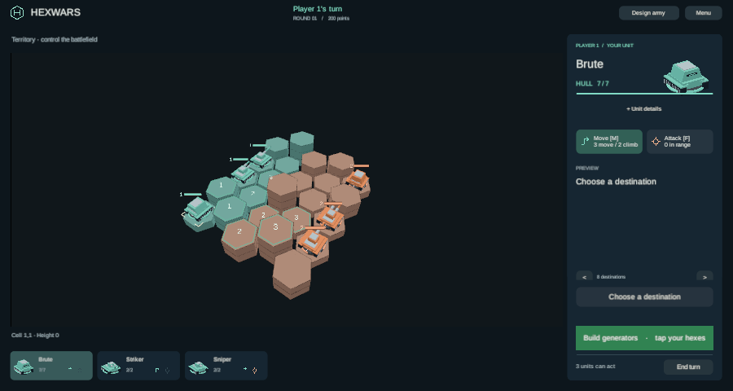
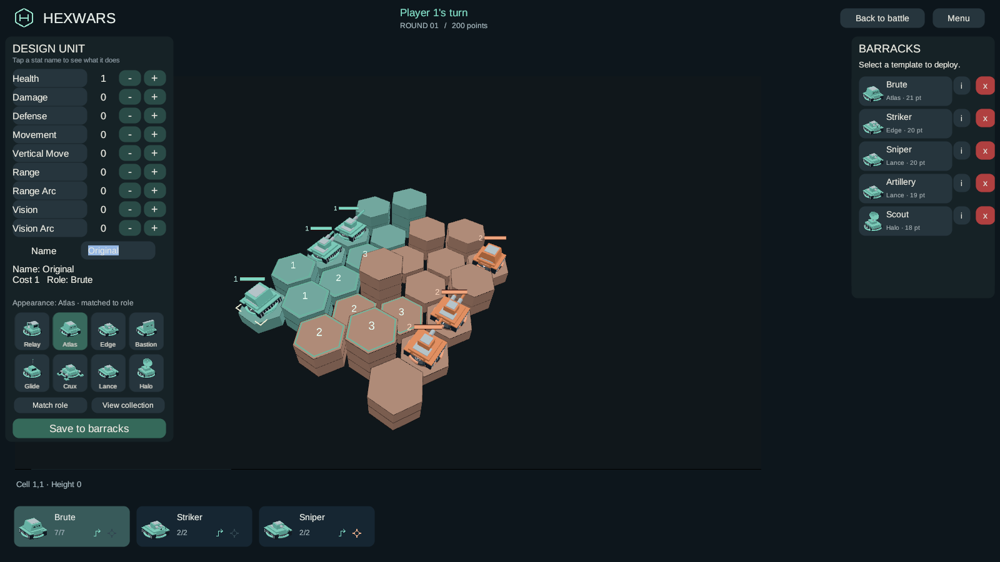

# Polish integration review

This follow-up brings the sound and gameplay passes together. Their original validation receipts remain
available; [the final integration receipt](evidence/polish-integration-checks.json) covers the review
follow-up and refreshed builds.

- PR25 / 4107017918: fast-forward retains one important result from the entire queue. A conclusion
  takes priority over destruction and automatic turn cues. Each queued action evaluates its own
  visibility. Two PlayMode cases enqueue actual engine moves and kills, then verify one result clip
  and all three state commits after Reduced motion fast-forward.
- PR25 / 4107181854: fully hidden actions stay silent even when they automatically end a turn.
  Paired PlayMode cases verify the hidden negative and visible positive controls using real
  one-action-policy transitions. Public match conclusions retain their cue.
- PR24 / 4106646803: Escape restores the text present at focus before immediately dismissing the
  designer. Both desktop and browser cancellation share this behavior; stale browser blur events
  cannot recommit the discarded text. Two PlayMode cases cover cancel, close and reopen.
- PR24 / 4106646807: the first bounty waits for existing help, then a one-second quiet interval,
  before appearing once without blocking input. Pending coaching is discarded on opt-out, new
  match or return to the title. Three PlayMode cases cover deferred display and reset behavior.
- PR25 / 4107181866: ending a match dismisses current help and discards pending coaching. A latch
  rejects late tips even after the result banner closes; the next real match resets it. A fourth
  coaching test covers the banner, dismissal, preference toggles and next-game recovery.
- PR24 / 4106646799: no layout patch. `UiKit.Canvas` scales from 1600×900 with a 0.5 width/height
  match. A physical 900×480 window therefore has approximately 1643×876 canvas units and uses the
  side panel. Its territory decision viewport is approximately 552 canvas units high. The finding's
  negative-height calculation treats physical dimensions as canvas coordinates. The actual browser
  capture confirms the decision controls, territory action and End turn remain visible.

The initial new terminal-combat fixture used round one, when annihilation is deliberately disabled
by the engine. It was corrected to round two without changing game rules or weakening its terminal
assertion. The initial 37/38 PlayMode result is retained in `Library/PolishIntegration/` alongside
its corrected full-suite result.

The final source passes 671 EditMode and 41 PlayMode tests, including ten new review regressions.
Windows and WebGL builds and the browser checks are recorded in the integration receipt.

This review does not establish Steam release readiness or deploy the game to production. Native
preview builds disable Steam initialization; the local static browser preview provides hotseat/AI.

[Browser observations and audio measurement](evidence/integration-browser-checks.json) use the final
`5eeb69d9` bundle. The native capture uses the same source revision.

