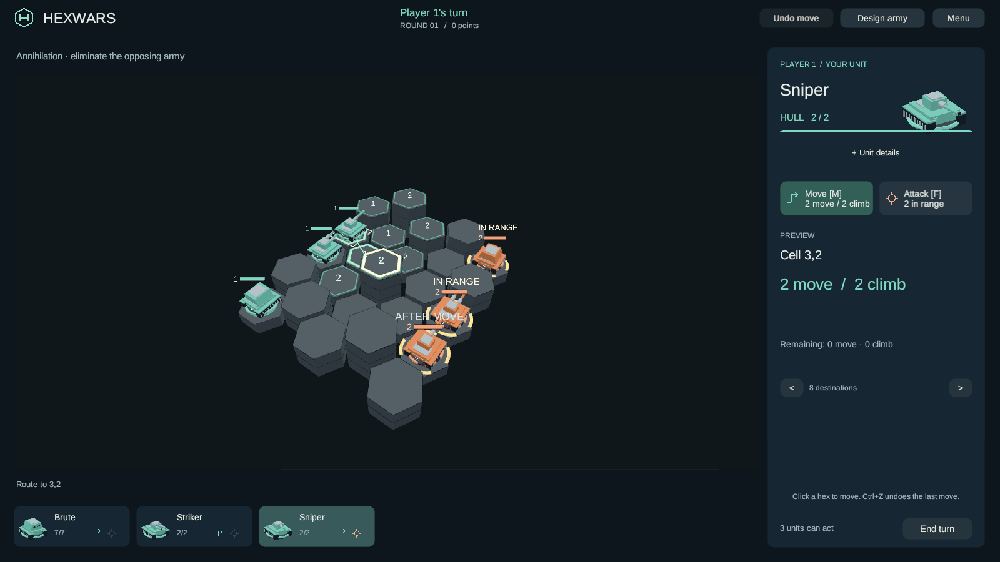
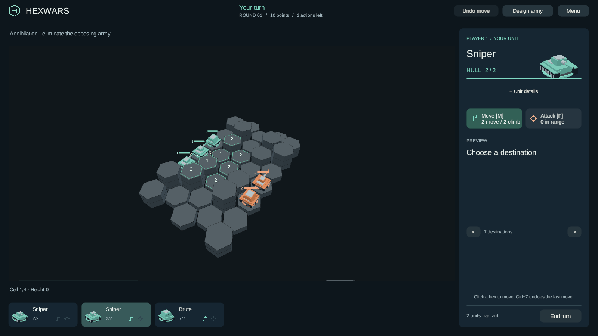

# Easier battlefield controls

Branch: `codex/smooth-movement-20260926`, based on the complete web build at `619515a`.

- Select a piece and click a reachable hex to move. Hover previews the route and its cost.
  Starting placement also takes one click, and can be rearranged freely before Ready.
- **Undo move**, or **Ctrl+Z / Command+Z**, restores the most recent move, elevation, movement
  budgets and action allowance. Both players see the same result after the server accepts it.
- Gold **IN RANGE** markers stay visible for the selected piece while examining another route.
  Muted **AFTER MOVE** labels identify additional targets available from the proposed destination.
- Click an enemy to inspect the damage, then click that enemy again or use **Fire**. There is no
  double-click timing requirement. Changing targets or pressing Escape does not fire.
- Clicking a spent squad card selects a matching unit with a legal move or attack remaining.
  Clicking a piece on the board selects that exact piece; when every matching unit is spent,
  the card still lets you inspect it. Selecting another piece returns the controls to movement.

Only the latest movement can be undone. Another accepted action, including an attack or a turn
handoff, makes it final. A subsequent move replaces the previous undo checkpoint. Undo is disabled
with fog of war so it cannot be used for free scouting. Moves that exhaust the turn allowance still
hand play to the opponent; their hover preview says that they cannot be undone.

Undo is an authoritative engine command, recorded alongside moves in the command log. Reconnecting
rebuilds the same undo availability by replaying the log. A client waits for acknowledgement before
changing the board, and a rejected or duplicate undo cannot rewind either player's state.

Deploy this branch's matching server and rebuilt WebGL client together. Existing browser sessions
must reload after deployment to understand the new command. See [web deployment](webgl-preview.md).
The previous audio changes and the H mark are included. No live deployment or PR merge is performed
by this work.

Validation: **1,192 engine tests, 671 Unity EditMode tests and 48 PlayMode tests passed**.
Coplay reported no compile errors or Unity error logs. Unity 6000.5.0f1 completed the WebGL
build from source commit `35e5ea9`; all four staged payloads match the build output. The payload
cache key is `159b83e6`.

Two actual WebSocket clients against a Production .NET 8.0.28 server verified private-room
listing, identical move/undo broadcasts, restored budgets, forged-seat rejection and reconnect
replay. Two separate Chrome contexts also played the rebuilt client against a local server:
one click moved, Undo restored the piece and allowance, a delayed second enemy click fired,
and clicking the spent Sniper card selected its ready counterpart. A separate hotseat browser
check verified Ctrl+Z restoring both movement budgets and the simultaneous IN RANGE / AFTER MOVE
markers. Both clients received the
same commands, with no browser errors or failed requests. Layout was inspected at 1600x900
and 1280x720. The browser backend used Linux .NET 10 with explicit major roll-forward;
the deployment-runtime transport check used Windows .NET 8 separately.

The [validation receipt](evidence/smooth-movement-checks.json) records payload hashes, test
counts, browser warnings and earlier failures, including one unresolved transient connection
failure in the transport harness. The original PlayMode footer fixture was corrected to inspect
the visible attack confirmation; the complete suite then passed.

[After a single-click move](evidence/smooth-movement-moved.png) ·
[After Undo](evidence/smooth-movement-undone.png) ·
[1280×720 layout](evidence/smooth-movement-1280.png)
