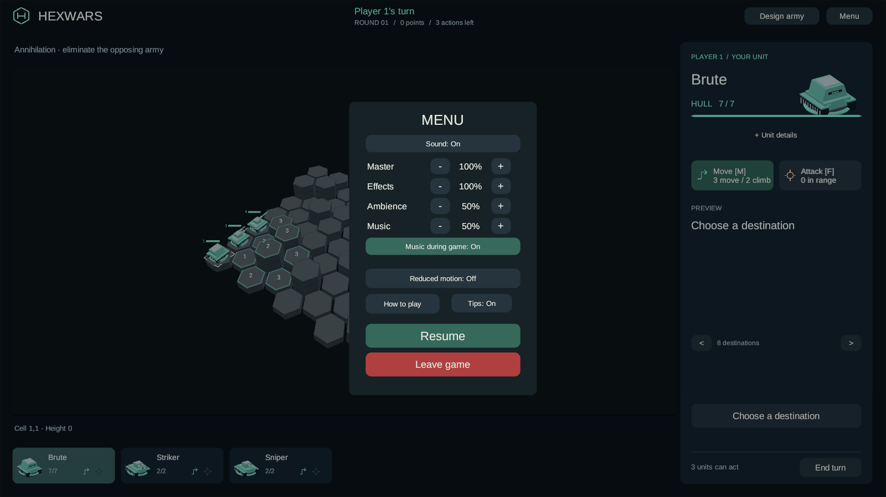
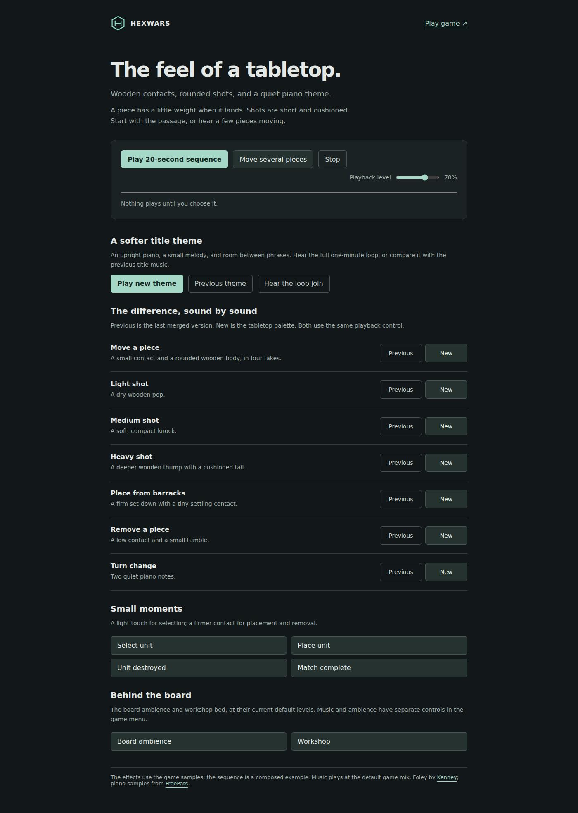

# Tabletop sound and a softer title

The second audio pass changes the character of the sounds. Movement uses a small chip contact
and a rounded wooden body, with four takes that never repeat consecutively. The twelve shots
are rebuilt from wooden and cushioned impacts: a dry pop for light weapons, a compact knock for
medium weapons and a deeper thump for heavy weapons. The old weapon recordings remain archived
in their original asset locations.

Selection, placement, removal, deployment and design confirmation use the same physical palette.
Turn, claim and match-complete cues use quiet piano notes. The title has a new, original upright-piano
arrangement: a small melody, open voicings and pauses between phrases, with a continuous one-minute
loop. Board ambience and the workshop bed retain their existing recordings and levels.

**Music during a match:** open Menu and enable **Music during game** below the music volume.
The choice is saved, takes effect immediately, and keeps the same track position when moving
between the title, setup, online waiting and a match. Music volume and mute still apply independently of effects and
ambience. The default remains title-only.

The [music-setting receipt](evidence/music-during-game-checks.json) records the latest web update:
44 PlayMode tests pass, the rebuilt WebGL payload matches the staged files, and browser checks
confirm live switching and the saved choice after reload. A clean export of the committed server
publishes and serves those exact files in Production on .NET 8.0.28 without Steam credentials or
a database. The Windows player and the broader suites below retain their earlier validation.
See [branch deployment instructions](webgl-preview.md#deploy-the-feature-branch-without-merging).

The title arrangement is still provisional. The next piano audition should prioritize a rich,
soft, pleasant instrument tone, with the mood free to vary. User-supplied listening references:
[Van Gogh](https://music.youtube.com/watch?v=X9PBCSlhaY4),
[Along the River](https://music.youtube.com/watch?v=1a--sJ_Z9RQ), and
[La Rive Gauche](https://music.youtube.com/watch?v=0bQkPbV0XmE).
These are references only; their recordings are not included in the game.

Open [the sound study](http://localhost:8196/sound-study/). Try **Move several pieces**, compare the
shots with **Previous / New**, then use **Play new theme** and **Hear the loop join**. Previous means
the last merged sound pass. The effects match the game samples; the title preview includes the
same default music-bus gain. Nothing autoplays, Escape stops playback, and only one audition plays
at a time. Your game mix settings are preserved.

The [source notes](../../scripts/audio/README.md) include the score, reproducible preparation steps,
source provenance and licenses. The prior [sound direction](sound-direction.md) and
[integration review](integration-review.md) remain historical evidence.

Validation is recorded in [the tabletop receipt](evidence/tabletop-audio-checks.json). It covers
sample/import boundaries, actual playback, controls, builds and scoped regressions. These checks
do not decide whether the subjective balance is right; the comparison page is for that decision.

The Windows and WebGL builds include the palette. Unity checks pass: **671 EditMode and 42
PlayMode tests**. Source rendering is repeatable, the first imported-sample boundary failure is
retained in the receipt, and the corrected samples pass the original boundary limit.

The final browser run loaded the new title theme, accepted an attack and a confirmed move, and
reported no browser errors. Listen to captured game output: [title](evidence/tabletop-title-game.webm),
[shot](evidence/tabletop-shot-game.webm), or [movement](evidence/tabletop-move-game.webm).
