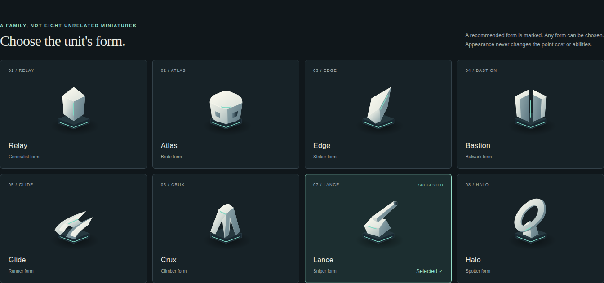

# Dark direction: simple, sculpted units

**Review addition, 2026-09-24.** This follows the request for more unit exploration, simpler and
more elegant forms, a dark theme, and selectable art during unit creation. It supersedes the
earlier recommendation to make the warm Workshop palette the default. Keep the workshop idea;
use the dark setting to frame the pieces.

Open the [interactive unit workshop](concept/units.html). On Windows you can also double-click
[Open Unit Workshop.cmd](<concept/Open Unit Workshop.cmd>) in Explorer; it opens the adjacent HTML
in the default browser without needing a server. These are browser concepts and original vector
studies, not a new Unity build or final production meshes.

## Review map: what is new

| Addition | Try it |
|---|---|
| Eight original forms, each with a distinct silhouette | Select any piece in the collection. The large view and board view change together. |
| Porcelain and graphite materials on a fully dark surface | Change Surface. This changes the finish, not the shape or team. |
| Appearance selection in the unit creator | Choose art explicitly, or use Match art to role for the stat-derived suggestion. |
| Persistent explicit choices | Choose Halo, change damage until the role becomes Striker, and observe that Halo stays selected. |
| Consistent preview sizes | Compare the same form at 32, 48 and 72 CSS pixels. Toggle Silhouette only. |
| Owner and selection treatment | Your army has a continuous mint rim; the opponent has an amber, broken rim. The selected piece has brackets outside its footprint. |
| Save/reopen/export | Save a design, change examples, then reopen it. Name, stats, form and finish return together. Export JSON includes the art ID. |
| Old study retained | The earlier comparison now opens in its dark Orbital direction and links to this new study. |



## A restrained family of pieces

Use a satin, light body over a dark footing. Limit the detail to one dominant volume, one functional
opening or projection, and one team-color seam. Edges carry the light; texture does not have to
do the work. The footprint is consistent, while height, width and negative space distinguish roles.

| Stable art ID | Form | Suggested existing role | Distinguishing shape |
|---|---|---|---|
| `relay-01` | Relay | Generalist | Symmetrical faceted core; a neutral form for tied stat leaders. |
| `atlas-01` | Atlas | Brute | Broad, rounded shoulders and a planted stance. |
| `edge-01` | Edge | Striker | A single forward-sloping blade. |
| `bastion-01` | Bastion | Bulwark | Paired upright shields with a narrow central opening. |
| `glide-01` | Glide | Runner | Two low swept runners and a compact bridge between them. |
| `crux-01` | Crux | Climber | A raised arch and three separated supporting feet. |
| `lance-01` | Lance | Sniper | A low body with one long, slender projection. |
| `halo-01` | Halo | Spotter | An open ring, visibly different from a solid turret. |

These names describe artwork, not new gameplay classes. Stats continue to determine abilities.
The existing game derives a dominant role from stats; the proposed art system suggests a form
using that role but permits a player's deliberate choice. Keep the actual role badge visible
alongside the art. An eventual competitive accessibility option can replace all custom forms
with canonical role symbols without changing the game.

There are **eight silhouettes and two finishes**, not sixteen mechanically distinct units.
Porcelain is the recommended default for readability against the dark board. Graphite is a
comparison option that still needs observation on real maps; material contrast in a browser
render is not proof of readability across every Unity lighting or fog condition.

Compare [graphite](evidence/unit-collection-graphite.png),
[flat silhouettes](evidence/unit-collection-silhouette.png), and
[team treatment on the board](evidence/unit-board-team-preview.png).
The previews suggest that Relay/Atlas and Edge/Lance deserve particular scrutiny at the smallest
scale. A separate role glyph should carry essential information when zoomed out; detailed shape
recognition must not be the only way to identify a unit.

## Creation behavior

The creator shows the stat-derived role separately from appearance. “Suggested” marks one form
in the collection; the selected form gets an outline and text check, not color alone.

1. A new automatic design receives the form for its dominant role.
2. Editing stats in automatic mode updates that suggestion and its previews.
3. Clicking a form makes the choice explicit. Later stat edits, including a different example
   allocation, keep that art. A short explanation reports any role/form mismatch.
4. Match art to role deliberately restores automatic matching.
5. Finish is independent of both role and owner. Team preview does not become saved ownership.
6. Saving records stats, selection mode, resolved art ID and finish. Reopening restores the
   explicit choice; a new example starts a separate draft. Updating an opened design updates
   that saved record rather than silently adding a duplicate.
7. An unavailable saved art ID falls back to role art, retaining name and stats, and reports that
   fallback. Unreadable storage is left untouched; new work remains in-session and can be exported.

Automatic matching mirrors [Roles.Dominant](../../engine/HexWars.Engine/Roles.cs): damage,
range + range arc, vision + vision arc, movement, vertical movement, defense and health compete.
A tie at the highest value produces Generalist. The earlier example named “Longshot” happened
to tie damage and combined reach; a name is not a reliable art selector. This study's new Longshot
example has combined reach 6 and damage 4, so its initial recommendation is unambiguously Sniper.

Browser saving uses the namespaced key `hexwars.polish.unit-designs.v1`. It is a local concept shelf,
not the game's barracks, Steam Cloud or server storage. The input limit of 12 is a study control
bound, not a proposed engine rule. The exported concept data is intentionally explicit:

```json
{
  "schemaVersion": 1,
  "name": "Cliffwatch",
  "appearance": {
    "selection": "crux-01",
    "resolvedArtId": "crux-01",
    "finish": "graphite"
  }
}
```

The actual export also contains a local design ID and all nine stats. In automatic mode,
`selection` is `auto` and `resolvedArtId` records the suggested asset at save time. These IDs are
whitelisted catalog entries, never a file path, uploaded image, arbitrary URL or unit name.

## Carrying the choice into Unity

Current [UnitTemplate](../../engine/HexWars.Engine/UnitTemplate.cs) stores only name and stats;
[Unit](../../engine/HexWars.Engine/Unit.cs) carries no art identity. The
[creation call](../../Assets/HexWars/Presentation/DesignPanel.cs) sends stats and name through
`CreateUnit`. [TokenStore](../../Assets/HexWars/Presentation/TokenStore.cs) chooses the role icon
from `Roles.Dominant(unit.Stats)`. A picker alone would therefore lose the player's choice as
soon as the design is deployed or reconstructed.

Implement the production feature as a complete presentation-data path:

| Boundary | Required behavior |
|---|---|
| Creator / barracks template | Store a stable appearance selection and finish independently of name and stats. Duplicating a design copies them. Editing stats keeps manual choices. |
| Creation and template-edit commands | Carry whitelisted art IDs through the server's normal validated command path. Keep the selection cosmetic; it must not affect legality, point cost or damage. |
| [Barracks catalog](../../engine/HexWars.Engine/Net/BarracksWire.cs) and [command wire](../../engine/HexWars.Engine/Net/CommandWire.cs) | Version the encoding explicitly. Older records without appearance fields use canonical role art. Define mixed-client compatibility rather than silently appending fields to the existing protocol. |
| Deployment | Copy resolved appearance onto the spawned unit, so deleting or editing the original template cannot restyle an already-deployed piece. |
| Immutable unit copies | Movement and damage copies must retain appearance. Do not accidentally reset it in `WithCell` or `WithDamage`. |
| Match snapshots / journal / recovery | Persist and round-trip the identity. Reconnecting players and replay viewers must reconstruct the same selected art, with a safe fallback if their catalog lacks it. |
| Renderer | Resolve the stable ID into a local approved asset/prefab. Apply owner color, selection, HP and action markers as separate presentation layers. Keep picking colliders consistent across forms. |
| Versioning / determinism | Version the appearance catalog. Keep combat decisions independent of art; explicitly define whether the existing snapshot/state digest covers the presentation fields. Do not change engine replay hashes as an incidental art tweak. |

Production validation should create a custom form, deploy it, move and damage it, disconnect both
clients, restart the server and reconnect. Check art and finish at every step alongside unchanged
gameplay outcomes. Repeat with a legacy template and an unavailable art ID. Then inspect all eight
forms on real elevations, fog states, owner colors, zoom levels and selected/disabled states in
the built player.

This branch does not modify those engine, wire or Unity systems. Keeping the first pass in an
interactive study makes the shape and creator behavior reviewable before a protocol-bearing
implementation lands beside the active multiplayer PR fixes.

## Assets and verification

The reusable renderer is [unit-art.js](concept/unit-art.js). Standalone vectors for every
form/finish and a manifest live in [concept/art/catalog.json](concept/art/catalog.json).
They are original code-authored SVG assets, with no downloaded fonts, external art or runtime
network dependency. They serve as precise form references for a later low-poly mesh set; a
finished animated 3D asset set has not been produced.

The [browser receipt](evidence/unit-art-checks.json) records 11 successful check groups, including
all eight art choices, role ties, manual override, save/reload, export, unknown-art fallback,
team/silhouette states, keyboard selection and layouts at 1280×720, 1920×1080 and 390×844.
No browser console/page errors or external network requests were observed in those checks.
A [storage follow-up](evidence/unit-storage-checks.json) also verifies update versus new-record
behavior, art preservation on rename, and honest session-only saving when storage is blocked or
contains unreadable data. Existing unreadable data is left byte-for-byte unchanged.
JavaScript syntax and local links were checked separately. Screenshots are review evidence;
recognition and aesthetic preference still need human playtesting.
