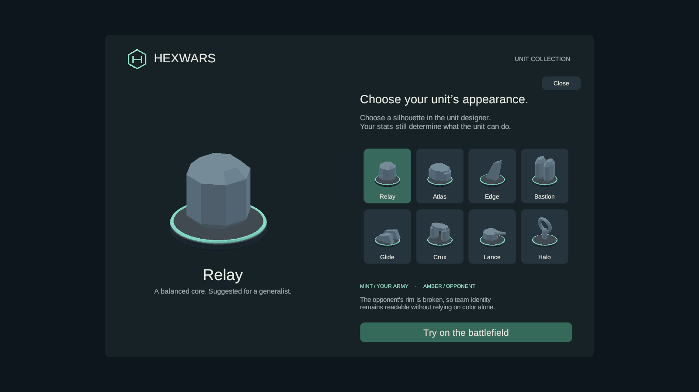
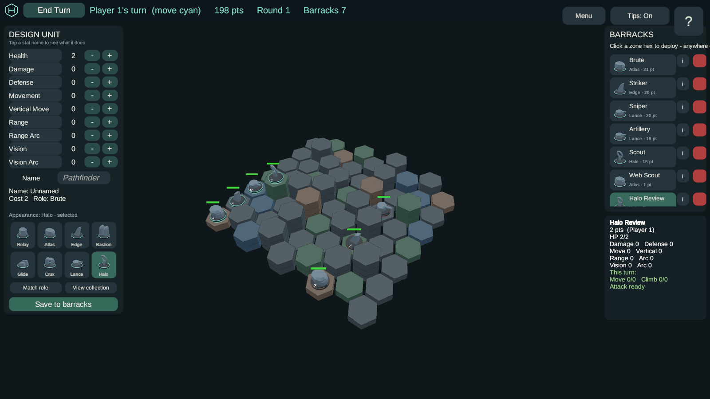

# WebGL preview

This branch includes a freshly built Unity browser client in
`engine/HexWars.NetServer/wwwroot/`. It contains eight selectable unit forms, the dark board and
interface, a focused tactical HUD with explicit movement/attack confirmation, and the H-in-hex mark
on the loader, title, collection and match header. Unit stats and damage arithmetic expand under
**Unit details**; compact squad cards keep the default view quiet. Material/theme
descriptors are removed from the game screens; the eight form names remain.

The latest build differentiates the armies with colored hulls and owner-correct portraits, mirrors
Player 2's backline placement, hides inactive biomes, and marks attackable enemies before target
selection. Movement previews label future shots separately. Double-clicking the previewed destination
or enemy confirms the action; a single click still previews. The canvas no longer treats double-click
as a fullscreen shortcut.

**Place starting units** in setup allows both players to rearrange their army freely within their
starting area, including raised hexes. Select a unit and double-click a highlighted empty hex, then
press **Ready** when finished. Round one starts after both armies are ready. The default remains
automatic placement; AI opponents keep that formation. Escape immediately dismisses help and the
designer, and automatic tips are smaller and expire after six seconds.

## Run the committed build

For local AI, hotseat and the unit collection, serve the static files from the repository root:

```sh
python -m http.server 8196 --bind 127.0.0.1 --directory engine/HexWars.NetServer/wwwroot
```

Open `http://localhost:8196`. Select **Unit collection**, inspect a form and choose
**Try on the battlefield**. Open **Design army**, choose an appearance, adjust stats and select
**Save to barracks**. Selecting **Match role** returns to automatic art selection.

To use Browse/Host/room-code multiplayer, run the matching .NET server from
`engine/HexWars.NetServer` with `dotnet run -- --urls http://127.0.0.1:8196`, setting
`ASPNETCORE_ENVIRONMENT=Production` and `LOBBY_PROVIDER=Legacy` in that terminal first. Stop any
static server already using the port. The .NET server serves the same `wwwroot` folder alongside
the WebSocket routes. A static file server does not provide the multiplayer backend.
Manual placement requires the matching updated clients and server because it adds setup commands
and an optional replay flag. Custom Steam lobbies accept it; quick-v1 keeps automatic placement.

Steam is optional in this mode, including Production: no `STEAM_APP_ID`, publisher key, database,
public match URL or match build ID is required. `Legacy` is also the default when `LOBBY_PROVIDER`
is unset. Selecting `Steam` or `Legacy,Steam` explicitly still requires the full Steam configuration.
This startup fix changes only the server; the WebGL player bundle does not need rebuilding.

Steam lobbies, invitations and the persistent match-service entry flow still belong to the native
Steam client. Browser guest accounts/invite links and the sound pass are separate follow-up work.
This branch has not been deployed to the production site.

## Tactical implementation validation

The latest [battlefield clarity receipt](evidence/battlefield-clarity-checks.json) covers this revision.
The [implementation receipt](evidence/tactical-implementation-checks.json) and
[browser receipt](evidence/tactical-webgl-checks.json) preserve the preceding implementation checks. The gameplay/UI walkthrough
and actual Unity screenshots are in [gameplay-visual-language.md](gameplay-visual-language.md).
The historical receipts below describe the earlier build; they are retained as earlier evidence.

## Rebuild

Use Unity 6000.5.0f1 with WebGL support installed:

1. Run `engine/build-to-unity.ps1` in Windows PowerShell.
2. Run **HexWars > Build WebGL**, or the editor method
   `HexWars.Presentation.EditorTools.WebGLBuild.Build` in batch mode.
3. Run `engine/stage-webgl-deploy.ps1` to refresh the tracked server bundle and its cache keys.

The build uses gzip with Unity's decompression fallback, so ordinary static servers can serve it.
`Assets/HexWars/link.xml` preserves the collider types selected dynamically by `CreatePrimitive`.
The first browser validation found these types had been stripped, despite a successful build;
the original build and browser log remain in `Library/GraphiteValidation/` for comparison.

Portraits are requested only by visible UI, with at most one uncached render per frame. Buttons
share 128×128 GPU textures per form and owner; a 512×512 portrait is generated only when its form
is inspected. RawImage displays the render texture directly, without a CPU pixel readback. This
addresses the startup work identified in PR #23's review.

Manual appearance travels through command, catalog, deployment and replay data. Existing automatic
designs retain their legacy formats; explicit choices require matching client/server engine
versions. See [appearance compatibility](windows-preview.md#appearance-data-and-compatibility).

## Validation

- Unity WebGL build succeeded with zero build errors; the compressed payload is about 26 MB.
- Chrome loaded the staged build at 1600×900 with no console/page errors or failed requests.
  The H mark was checked on the loader, title, collection and match header.
- Through the actual browser UI, a manual Halo choice survived a health edit, text entry,
  saving to barracks and deployment. Deployment spent two points and rendered Halo on the board.
- Engine: 1,174 tests passed. Unity EditMode: 664 passed. Unity PlayMode: 7 passed, including
  hidden-panel deferral and separate button/hero GPU texture sizes after the portrait change.
  WebGL input bridge: 1 passed. Server regressions: 962 passed with disposable PostgreSQL 16
  after making Steam configuration optional for Production WebGL hosting.
- The initial server run had no Docker/database and was aborted; its failure log is retained.
  The final database-backed run passed in full. Earlier browser collider errors are also retained.
- Chrome reported three nonfatal Unity warnings: persistent-data synchronization deprecation,
  an additional-light cookie format fallback, and unsupported FSR upscaling under SwiftShader.

Build hashes and counts: [build receipt](evidence/webgl-build-checks.json).
Browser log and resource statuses: [browser receipt](evidence/webgl-browser-checks.json).
Production startup and anonymous browser room flow: [optional Steam receipt](evidence/webgl-steam-optional-checks.json).
Checks cover local rendering, gameplay and browser room startup; they do not establish live multiplayer recovery or
production/Steam release readiness.




