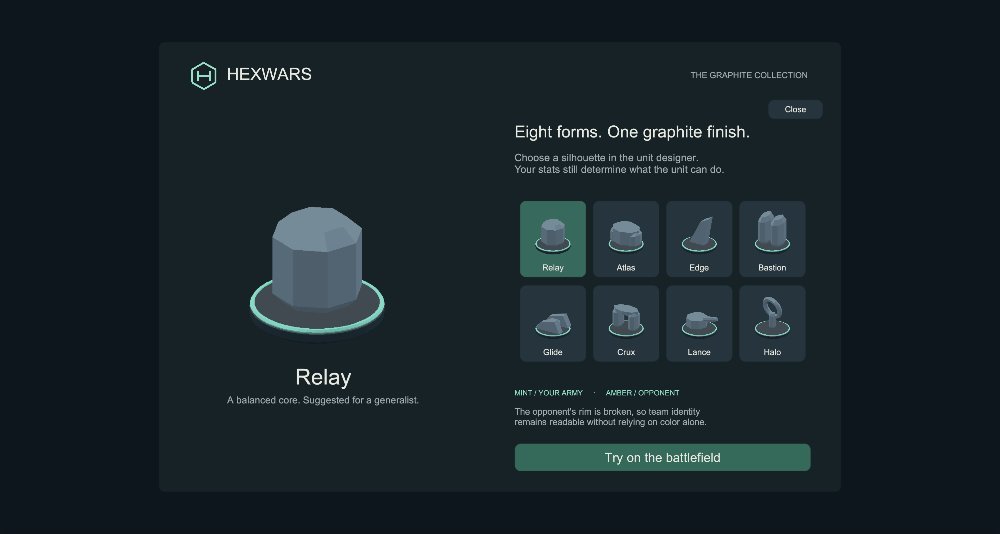
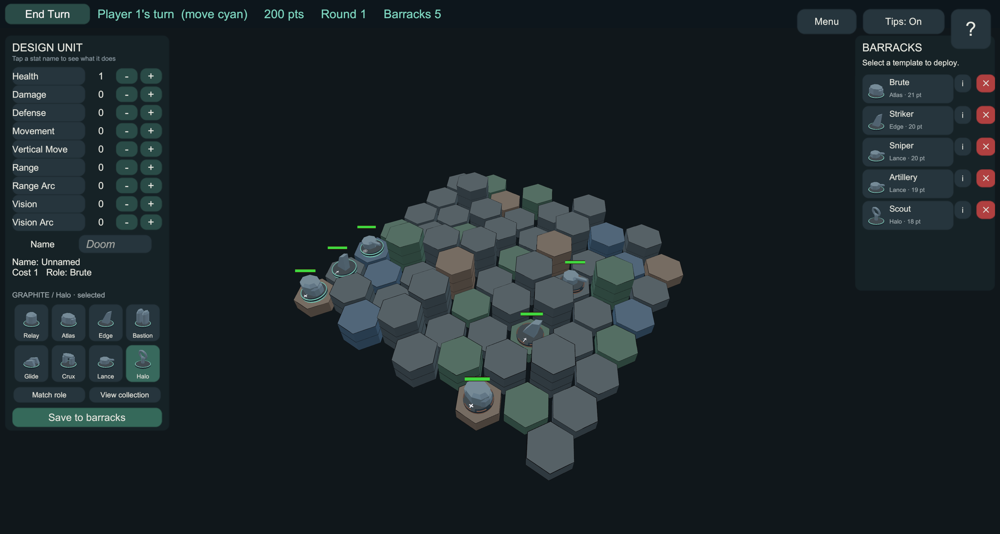

# Current tactical Windows preview

Open [Open Tactical Game.cmd](<Open Tactical Game.cmd>) or
`Build\TacticalPreview\HexWars.exe`. Unity Play Mode is not required.
This contains the new machine meshes and cleaner tactical interface. Use **Unit details** for full
stats and attack arithmetic, **Design army** for creating/deploying units, and **Menu** for help,
sound and Reduced motion. See [the walkthrough and screenshots](gameplay-visual-language.md).

Build it in Unity with **HexWars → Build Tactical Windows Preview**. This standalone preview does
not require Steam; native Steam integration remains a separate configured build path.

---

# Graphite Windows preview

This feature branch applies the graphite direction to the Unity game. It adds eight original
procedural 3D forms, mint/amber team rims, a charcoal interface and terrain palette, and the
H-in-hex logo from the original visual study.

## Open the app

Double-click **Open Graphite Preview.cmd** at the root of this feature checkout. The launcher
opens `Build/GraphitePreview/HexWars.exe` directly in the collection screen. Unity and Play Mode
are not needed to run the built app. Keep the entire `GraphitePreview` directory together.

Choose any of the eight forms for a larger view, then select **Try on the battlefield**. This
starts a local two-player match with points available to experiment. In the left designer:

1. Adjust the stats and name.
2. Choose a graphite form. Its thumbnail comes from the same mesh used on the board.
3. Select **Save to barracks**, then select the new design in the right barracks and place it
   on a legal deployment cell.
4. **Match role** restores automatic selection. Manual selections survive stat edits.

WASD pans, Q/E rotates, and the wheel zooms the battlefield. The collection can also be opened
from the designer or title screen. Existing AI and hotseat flows use the same pieces.

The app is a local preview. Steam initialization is disabled in this build; no Steam App ID is
needed. Existing session barracks remain session-scoped, so quitting the application restores
the starter catalog. A Windows installer, signing and Steam publication are outside this build.

## Build again

1. Run `engine/build-to-unity.ps1` in Windows PowerShell.
2. Open this feature checkout in Unity 6000.5.0f1.
3. Select **HexWars > Build Graphite Windows Preview**.

The editor method `HexWars.Presentation.EditorTools.GraphitePreviewBuild.Build` also supports
Unity batch mode. It builds Windows x64, saves the charcoal camera background in the scene,
and persists a resizable 1600×900 window default. The output is `Build/GraphitePreview/`.

## Appearance data and compatibility

The stable IDs are `relay-01`, `atlas-01`, `edge-01`, `bastion-01`, `glide-01`, `crux-01`,
`lance-01` and `halo-01`. Empty means automatic role matching. Unknown IDs fall back to role
art; they are never interpreted as paths. Graphite is the Unity finish for every form.

Appearance travels through create/replace commands, session catalogs, deployment, immutable
movement/damage copies, and replay/start-state serialization. Separate designs with identical
stats and names may have different appearance selections. Cost, legality and combat calculations
continue to use stats.

Automatic legacy designs retain the previous command, catalog and replay formats. Explicit
appearance uses `C2` / `REPLACE2`, barracks `V2`, and `HEXWARS-REPLAY 2`. Older readers reject
these versioned records. A replay containing appearance intentionally has a different serialized
identity; existing automatic records preserve their bytes. This branch does not deploy a server
or promise mixed-version multiplayer. Use matching client/server engine builds for those records;
capability negotiation and a real restart/reconnect integration run remain release work.

See `Library/GraphiteValidation/` for local test/build/runtime receipts and `docs/polish/evidence/`
for shareable captures. The earlier browser studies are retained as design references.

## Validation

- Engine regression suite: 1,174 passed. The initial run found an outdated test fixture that
  treated `V2` as an unknown catalog version; the unsupported-version control now uses `V99`.
- Unity EditMode: 664 passed, including the final dark-input correction. The first run used
  a null graphics device, which cannot render thumbnails; headless hosts now skip portrait
  rendering, and the successful visual checks used a real graphics device.
- Unity PlayMode: 6 passed, including manual Halo selection, a subsequent health change,
  creation through the designer, session-catalog retention, deployment and the resulting mesh.
  The first smoke fixture omitted the game's normal presenter initialization; it was corrected
  before the passing run. These initial receipts remain in `Library/GraphiteValidation/`.
- Engine Release DLL and the plugin consumed by Unity have matching SHA-256 hashes.

Native build and rendered capture results are recorded in `evidence/graphite-native-checks.json`.
These checks validate this local preview; they do not establish Steam release readiness.
These native captures and the existing portable app precede the final label cleanup and in-game
H logo. The [WebGL build](webgl-preview.md) contains those latest presentation changes.

## Browser build and multiplayer boundary

The WebGL target uses the same unit meshes, appearance picker and dark interface. The H-in-hex
mark appears in the loading page, title/collection screens and in-game header. Player-facing
screens omit material/theme labels; Relay, Atlas, Edge, Bastion, Glide, Crux, Lance and Halo remain
unit-art names.

Run **HexWars > Build WebGL**, then `engine/stage-webgl-deploy.ps1` to copy the generated bundle
into the tracked `engine/HexWars.NetServer/wwwroot/` folder. Staging also versions the payload URLs
so a browser cannot pair cached files from different builds. Review the staged build on this
feature branch before any production deployment.

The browser uses Browse/Host/room-code multiplayer. Steam invitations, lobbies and the new
persistent match-service entry path belong to the native Steam client. A browser guest-session
or Steam OpenID entry path would need an additional identity/lobby integration; this build does
not claim that functionality.
